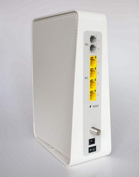

# Compal-Wifi-Switch
[](https://pypi.org/project/compal-wifi-switch/)
[](https://pypi.org/project/compal-wifi-switch/)
[](https://opensource.org/licenses/Apache-2.0)

[](https://github.com/frimtec/compal-wifi-switch/actions?query=workflow%3ABuild)
[](https://github.com/frimtec/compal-wifi-switch/actions?query=workflow%3A%22Deploy+release%22)

A command line tool to switch on/off the wifi signal of a Compal-CH7465LG cablemodem.




Wifi radiation should be turned off if not used (better for your health and for IT security reasons). 
Unfortunattly the Compal-CH7465LG cablemodem does not offer a physical button to switch on/off the wifi signal.
There is also no configuration available to switch the wifi signal on/off based on a time schedule.

The compal-wifi-switch tool can switch the wifi signal on/off via a command line interface. 
The tool can be installed on any device where Python3 runtime is available (NAS, Raspberry Pi, etc.). 
To schedule compal-wifi-switch you can use any scheduling mechanism (e.g. cron, Synology task scheduler, ...).  

## Installation
### Using pip
1. Install python3.7 or higher
1. Install compal-wifi-switch with ```pip install compal-wifi-switch```.
1. Run compal-wifi-switch with ```compal-wifi-switch --help```.

### Without pip (e.g. on Synology DSM)
1. Download package from [PyPi](https://pypi.org/project/compal-wifi-switch/#files) (tar.gz) to your server.
1. Run the following commands:
```
# Install
user@dsm:~> tar xfv compal-wifi-switch-<version>.tar.gz
user@dsm:~> cd compal-wifi-switch-<version>
user@dsm:~/compal-wifi-switch> python3 setup.py install --user

# Run
user@dsm:~> python3 ~/compal-wifi-switch-<version>/compal_wifi_switch/main.py --help
```

## Usage

### General syntax
```
usage: compal-wifi-switch [-h] [--version] {status,switch} ...

Compal-Wifi-Switch configuration

optional arguments:
  -h, --help       show this help message and exit
  --version, -v    show program's version number and exit

command:
  {status,switch}
    status         shows the current status of the cablemodem
    switch         switches the wifi state of the cabelmodem    
```

### Command switch
#### Usage
```
usage: compal-wifi-switch switch [-h] [--band {2g,5g,all}] [--guest [GUEST ...]]
                      [--pause PAUSE] [--host HOST] [--password PASSWORD]
                      [--verbose]
                      {on,off}

positional arguments:
  switch
  {on,off}

optional arguments:
  -h, --help            show this help message and exit
  --band {2g,5g,all}, -b {2g,5g,all}
                        band to switch power state for (default = all)
  --guest [GUEST ...], -g [GUEST ...]
                        list of guest network mac-addresses to activate while
                        switching ON wifi
  --pause PAUSE, -p PAUSE
                        number of seconds to pause after wifi state change
                        (default = 45); when the pause is too short, the
                        following modem commands may block forever
  --host HOST           host name or IP of compal cablemodem, or use env
                        variable COMPAL_WIFI_SWITCH_HOST
  --password PASSWORD   password of compal cablemodem, or use env variable
                        COMPAL_WIFI_SWITCH_PASSWORD
  --verbose             verbose logging
```
#### Example
To enable the wifi signal for the 2GHz band including the activation of the guest network, use the following command:
```
> compal-wifi-switch switch on --host 192.168.0.1 --password <YOUR_PW> --band 2g --guest 92:5C:34:DD:6F:0A

Switching wifi ON (band = 2g)
Activating guest networks 92:5C:34:DD:6F:0A
```

### Command status
#### Usage
```
usage: main.py status [-h] [--format {json,text}] [--host HOST]
                      [--password PASSWORD] [--verbose]

positional arguments:
  status

optional arguments:
  -h, --help            show this help message and exit
  --format {json,text}, -f {json,text}
                        output format
  --host HOST           host name or IP of compal cablemodem, or use env
                        variable COMPAL_WIFI_SWITCH_HOST
  --password PASSWORD   password of compal cablemodem, or use env variable
                        COMPAL_WIFI_SWITCH_PASSWORD
  --verbose             verbose logging
```

#### Example
To show the status of the wifi signal, use the following command:
```
> compal-wifi-switch status --host 192.168.0.1 --password <YOUR_PW>

==============================================================
 Modem
==============================================================
 Model               : CH7465LG
 HW Version          : 5.01
 SW Version          : CH7465LG-NCIP-6.15.28-4p8-NOSH
 Serial Number       : ************
 Modem MAC Address   : **:**:**:**:**:**
 Operator ID         : LIBERTYGLOBAL
 Network Mode        : IPv4
 Uptime              : 50day(s)0h:12m:28s

==============================================================
 WIFI BANDS
==============================================================
 State Band Hidden SSID
 ----- ---- ------ ----------------
 ON    2g   OFF    FRIMTEC
 OFF   5g   OFF    FRIMTEC

==============================================================
 WIFI GUEST NETWORKS
==============================================================
 State Band MAC               Hidden SSID
 ----- ---- ----------------- ------ ----------------
 ON    2g   92:5C:34:DD:6F:0A OFF    FRIMTEC-GUEST
 OFF   5g   92:5C:44:DD:6D:CA OFF    FRIMTEC-GUEST

```

## Credits
* Using [compal_CH7465LG_py](https://github.com/ties/compal_CH7465LG_py) by [ties](https://github.com/ties/) to communicate with Compal cable modem.
